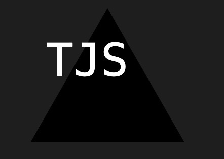

# Title:

SVG Logo Generator

## Table of Contents:

[Description](#description)

[Installation](#installation)

[User Information](#user-information)

[Contributions](#contributions)

[Tests](#tests)

[Questions](#questions)

[What I Learned](#what-i-learned)

[Code in index.js](#code-in-javascript-index)

[Dependencies](#dependencies)

[Link to live site](#link-to-live-site)

[Link to gitHub Repo](#link-to-github-repository)

[Images Of website functionality](#images-of-webpage-functionality)

[License](#license)

## Description:

This application will prompt the user with an array of questions from the terminal. Which once completed will dynamically create a SVG logo corresponding to the user choices.

## Installation

Fork this repo. Then in the terminal run //~ npm init -y //~ npm i inquirer@8.2.4 - To launch application run in terminal //~ node index
-- For further instruction please follow the [video tutorial](#video-tutorial)

## User Information

<a href='https://github.com/RaszeroT'>Travis Shanhun's github username: RaszeroT</a>

Email: shanhun.codes@gmail.com

## Contributors

Chris Brewer - Student 
Andrew Hudgins - TA

## Tests 

To test this application please install jest by running in the Terminal //~ npm i --save--dev jest

To launch the test run in terminal //~ npm test

This command will run two suite tests, one containing 1test and the other suite containing 3tests. Which will pass that the text and text color will be inserted into the SVG Logo correctly and the shape will be created correctly.

There will also be a testing section at the end of the [video tutorial](#video-tutorial).

## Questions

Please reach out to me if you have any further questions via:

Email: shanhun.codes@gmail.com

<a href='https://github.com/RaszeroT/svg-logo-generator'>Backend SVG Logo Generator repository</a>

## What I learned:

In this project I learnt that testing is important in the beginning of a project as early on I was able to debug a early typo before writing any code in the index.js.

## Code in JavaScript index:

Inquirer to prompt user 
Function to set text characters and color 
Function to set shape choice

## Dependencies 

inquirer@8.2.4 
jest@29.7.0

## Link to live site:

<a href="N/A">No live site to link</a>

## Video Tutorial:

<a href=''>Video Tutorial</a>

## Example Images:

 
 
 

## License

MIT License

Copyright (c) 2023 RaszeroT

Permission is hereby granted, free of charge, to any person obtaining a copy
of this software and associated documentation files (the "Software"), to deal
in the Software without restriction, including without limitation the rights
to use, copy, modify, merge, publish, distribute, sublicense, and/or sell
copies of the Software, and to permit persons to whom the Software is
furnished to do so, subject to the following conditions:

The above copyright notice and this permission notice shall be included in all
copies or substantial portions of the Software.

THE SOFTWARE IS PROVIDED "AS IS", WITHOUT WARRANTY OF ANY KIND, EXPRESS OR
IMPLIED, INCLUDING BUT NOT LIMITED TO THE WARRANTIES OF MERCHANTABILITY,
FITNESS FOR A PARTICULAR PURPOSE AND NONINFRINGEMENT. IN NO EVENT SHALL THE
AUTHORS OR COPYRIGHT HOLDERS BE LIABLE FOR ANY CLAIM, DAMAGES OR OTHER
LIABILITY, WHETHER IN AN ACTION OF CONTRACT, TORT OR OTHERWISE, ARISING FROM,
OUT OF OR IN CONNECTION WITH THE SOFTWARE OR THE USE OR OTHER DEALINGS IN THE
SOFTWARE.
